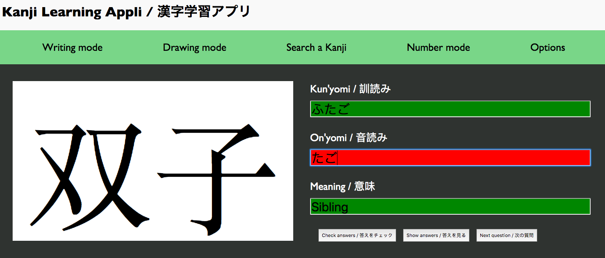
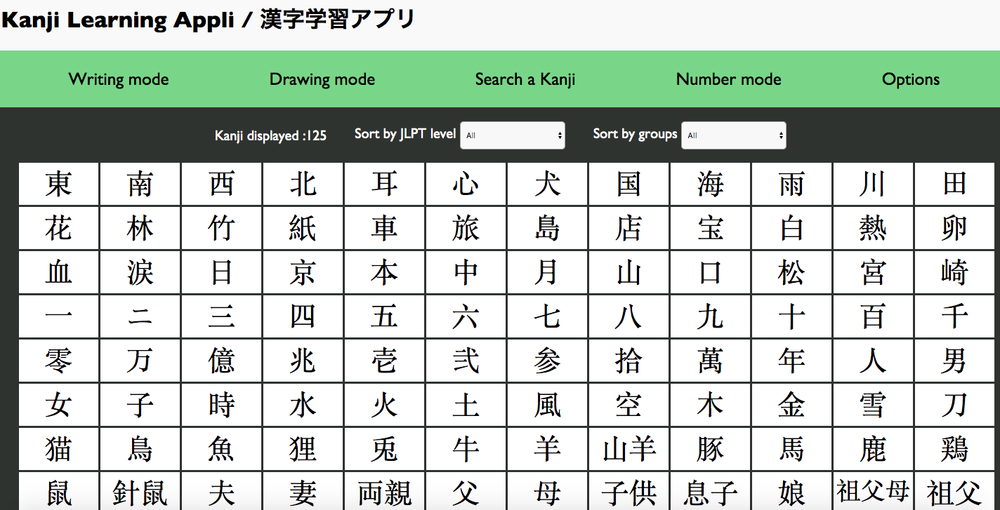
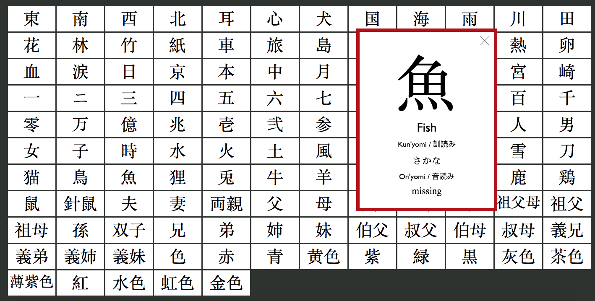
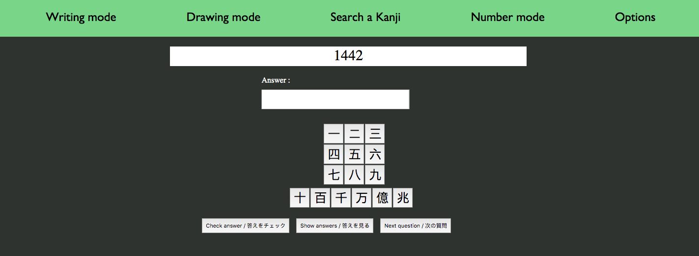

## Project overview

This is a browser app made for those who wants to learn Japanese Kanji.

## How to make it work

Open `index.html` to view it in the browser.

## Features

### Home Page

`Kanji Quiz` : The home page is actually a quiz. A random kanji is selected and displayed on the left of the screen.

`Inputs` : Three inputs are on the right. The first one is where you'll put the kunyomi for this kanji. If there's several kunyomi readings for this kanji, separate them with a `;` 
The second input is where you'll put on Onyomi readings.
In the third input, you'll have to write the meaning of this kanji ( in english, so that you improve also this language ! )

`Check your responses` : Once you finished typing your answers, you can click on the `check Answers` button. Correct answers will be colored in green and wrong ones in red.

`Show responses` : If you do not know the answers, or want to correct yours, click on the `show answers` button to have the correct answers displayed.

`Skip the parts you already know` : If you want to have a quick learning, you can skip the kanji you already know by pressing the third button

### Collection Page

`Search a specific kanji` : On this page, all Kanji that you cand find in the quiz are listed. You can click on one kanji to make a card display, and have access to its kunyomi & onyomi readings.

### Number Page

`Improve your Japanese Number reading & writing` : This page is also a quiz, in which a random number is displayed, sometimes in arabic, sometimes in japanese. Your goal is to write the answer of this number, in Japanese or in arabic depending on what is asked.

